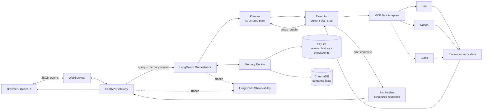

# CogniFlow — Autonomous Agentic RAG & Live Context Engine

CogniFlow is a stateful enterprise AI assistant that moves beyond static document search. It decomposes complex requests, plans multi-step work, queries live tool adapters, retrieves hierarchical memory, and streams its execution state to the browser in real time.

[](https://www.python.org/)
[](https://fastapi.tiangolo.com/)
[](https://langchain-ai.github.io/langgraph/)
[](https://react.dev/)
[](https://www.docker.com/)
[](https://smith.langchain.com/)

## Why CogniFlow

Traditional RAG behaves like a search engine over a static corpus: retrieve a chunk, then generate an answer. CogniFlow treats the request as a durable execution problem. The agent plans a sequence, gathers fresh evidence through MCP connectors, incorporates both session history and semantic user facts, recovers from connector failures, and exposes the execution trace while work is in progress.

## Key Capabilities

- **Cyclic reasoning and decomposition:** LangGraph coordinates planning, sequential tool execution, evidence aggregation, synthesis, and dynamic replanning.
- **Hierarchical dual memory:** SQLite stores ordered session messages and LangGraph checkpoints; ChromaDB stores durable, user-scoped semantic facts using local SentenceTransformers embeddings.
- **Universal tool boundary:** Model Context Protocol provides the connector contract for live systems. The repository includes deterministic Jira and Notion adapters, with the tool layer ready for Slack and additional enterprise systems.
- **Real-time thought streaming:** FastAPI WebSockets publish status transitions, tool activity, token chunks, and completion events without polling.
- **Human-in-the-loop safety:** The compiled graph pauses before executor actions so write or destructive plans can be reviewed before a connector is allowed to run.
- **Self-correction:** Tool exceptions become structured state, return to the planner, and are capped at three retries to prevent runaway loops.
- **Production observability:** LangSmith traces planner, executor, connector, and synthesizer runs for latency analysis and failure diagnosis.

## Architecture



## Technology Stack

| Category | Technology | Responsibility |
| --- | --- | --- |
| Frontend | React 18 | Responsive chat workspace and streamed state presentation |
| Frontend | Vite | Fast development server and production bundling |
| Frontend | Tailwind CSS | Utility-first responsive visual system |
| Frontend | Framer Motion | Execution trace and interaction animation |
| Orchestration and intelligence | LangGraph | Stateful plan-and-execute graph with interrupts and retries |
| Orchestration and intelligence | Groq / Llama 3.3, OpenAI | Pluggable reasoning and synthesis providers |
| Memory and retrieval | ChromaDB | Persistent vector retrieval for long-term facts |
| Memory and retrieval | SQLite | Session messages and graph checkpoints |
| Memory and retrieval | SentenceTransformers | Zero-cost local embedding generation |
| Tool layer | Model Context Protocol | Standardized enterprise connector boundary |
| Observability | LangSmith | LLM, graph, tool, latency, and error traces |
| Infrastructure | Docker Compose | Local multi-service deployment and persistent data mounts |
| Infrastructure | Nginx | Static frontend production serving |

## Repository Layout

```text
cogniflow/
├── backend/
│   ├── app/
│   │   ├── agent/
│   │   │   ├── nodes/
│   │   │   │   ├── executor.py
│   │   │   │   ├── planner.py
│   │   │   │   └── synthesizer.py
│   │   │   ├── tools/mcp_client.py
│   │   │   ├── graph.py
│   │   │   ├── llm.py
│   │   │   └── state.py
│   │   ├── memory/
│   │   │   ├── long_term.py
│   │   │   ├── manager.py
│   │   │   └── short_term.py
│   │   ├── schemas/memory.py
│   │   ├── config.py
│   │   ├── main.py
│   │   └── ws_manager.py
│   ├── tests/
│   │   ├── test_graph.py
│   │   ├── test_memory.py
│   │   ├── test_agent_graph.py
│   │   └── test_ws.py
│   ├── Dockerfile
│   ├── requirements.txt
│   └── .env.example
├── frontend/
│   ├── src/
│   │   ├── components/
│   │   ├── hooks/useChat.js
│   │   └── __tests__/Chat.test.jsx
│   ├── Dockerfile
│   ├── package.json
│   └── vite.config.js
├── chroma_data/
├── sqlite_data/
├── docker-compose.yml
└── README.md
```

## Getting Started

### Docker Compose

```powershell
git clone https://github.com/Ashish-Ranjan/CogniFlow.git
cd CogniFlow/cogniflow
Copy-Item backend/.env.example backend/.env
docker compose up --build -d
```

The services are available at:

- Frontend: `http://localhost:3000`
- Backend health: `http://localhost:8000/health`
- Frontend development server: `http://localhost:5173`

The Compose baseline reads `backend/.env.example`. For LangSmith tracing, add the API key to `backend/.env` and point the backend `env_file` entry in `docker-compose.yml` to `./backend/.env`.

### Local Development

Backend:

```powershell
cd cogniflow/backend
python -m venv .venv
.\.venv\Scripts\Activate.ps1
pip install -r requirements.txt
uvicorn app.main:app --reload
```

Frontend, in a second terminal:

```powershell
cd cogniflow/frontend
npm install
npm run dev
```

Configure local persistence and telemetry by copying `backend/.env.example` to `backend/.env`. The default local data paths are `./conversations.db` and `./chroma_db`.

## API and WebSocket Surface

```powershell
curl http://localhost:8000/health
curl -X POST http://localhost:8000/api/memory/fact -H "Content-Type: application/json" -d '{"user_id":"user-1","fact":"The team tracks work in Jira"}'
curl "http://localhost:8000/api/memory/context?user_id=user-1&session_id=session-1&query=Jira%20work"
```

Connect to `ws://localhost:8000/ws/chat/session-1` and send:

```json
{"user_id":"user-1","query":"Summarize Project X risks and Q3 goals"}
```

The server emits `status`, `tool`, `token`, and `complete` JSON events. Graph execution can pause at the executor breakpoint for human approval before a sensitive action proceeds.

## Deterministic Testing

Backend tests cover SQLite and Chroma persistence, structured planner/executor/synthesizer routing, MCP failure recovery, retry limits, HITL checkpoints, health, and WebSocket streaming:

```powershell
cd cogniflow/backend
.\.venv\Scripts\Activate.ps1
pytest tests/ -v
```

Frontend tests cover mocked WebSocket state, the animated execution trace, and interactive citation badges:

```powershell
cd cogniflow/frontend
npm test
```

The release verification flow is documented in the testing commands above and can be extended with the same deterministic mocks used by the test suites.

## LangSmith Configuration

Add the following to `backend/.env`:

```env
LANGCHAIN_TRACING_V2=true
LANGCHAIN_ENDPOINT=https://api.smith.langchain.com
LANGCHAIN_API_KEY=
LANGCHAIN_PROJECT=CogniFlow-Agent
```

Restart the backend, submit a request, then open the `CogniFlow-Agent` project in LangSmith. The newest trace contains the planner, executor, MCP tool, retry, and synthesizer spans.

---

*Designed, architected, and maintained by Ashish Ranjan.*
